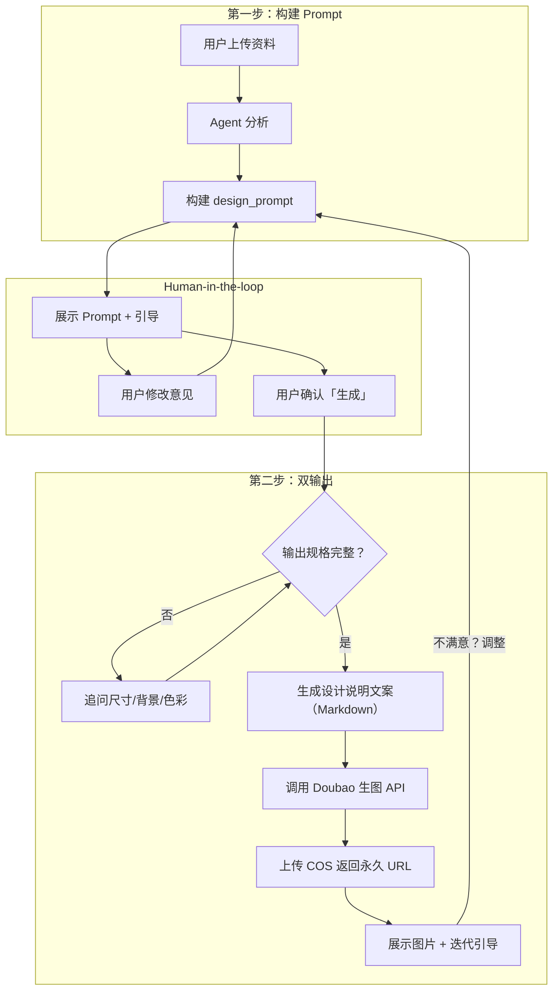

# 校庆 Logo 设计助手 AI Agent 产品需求设计 Plan（v3）

> **v3 核心变更**：
> 1. 重构为**双输出**模式：Logo 图片 + 设计说明文案（标志释义、色彩释义、图形释义）
> 2. System Prompt 从通用骨架升级为**基于真实案例的详细指导**，附带具体示例
> 3. 将生图 Prompt 重新设计为高精度的 Logo 专用描述规范

---

## 一、校庆 Logo 通用设计思路

基于四个校庆方案（兼善 90 周年、四川外国语 70 周年、南开融侨 20 周年、能源工业技师学院 70 周年），归纳出以下通用设计框架：

### 1.1 核心输入三要素

| 维度 | 含义 | 案例示例 |
|------|------|----------|
| **校庆周年数** | 主视觉核心，决定构图重心 | 90、70、20 |
| **学校主题色** | 校徽/VI 标准色，决定主色域 | 蓝紫渐变、青莲紫+玫红、红蓝 |
| **意向元素** | 校方要求的、或由校徽/校训/文化延伸 brainstorm 出的具象或抽象符号 | 校门、老树、跑道、齿轮、地球、波浪 |

### 1.2 真实案例拆解（供 System Prompt 参考）

#### 案例 A：兼善中学 90 周年
- **数字造型**：「9」的外形如同一条跑道，寓意继往开来、蒸蒸日上
- **色彩**：蓝紫渐变，校庆主题色
- **元素融合**：数字「90」下方「1930–2020」时间轴 + 校名文案
- **设计说明要点**：logo 分三部分，对每个视觉元素逐一释义，最后升华为"符合传播学原理和视觉心理"

#### 案例 B：四川外国语 70 周年
- **色彩释义**：校庆 LOGO 基本色彩（红黄渐变）与学校标志标准色彩（蓝色）相结合 → 红蓝渐变
- **图形抽象化**：地球→世界地图点阵、大海→波浪线条
- **设计说明要点**：分「校庆色彩」「图形元素」两个板块，配图展示具象→抽象的推导过程

#### 案例 C：能源工业技师学院 70 周年
- **数字造型**：「7」与书法（文化属性）结合，「0」为齿轮（工匠精神），组合为"70"
- **图形释义**：拆解为 4 个核心元素——70（同心共建）、齿轮（工匠精神）、速度（引领发展）、笔触（传承）
- **设计说明要点**：逐点解释每个元素的象征意义，连接到学校办学特色

### 1.3 关键发现：产出物不只是图，更是"设计方案"

> 真实的校庆 Logo 设计方案 = **Logo 图片** + **完整的设计说明文档**
> 
> 设计说明包含：标志释义（每个视觉元素的文化含义）、校庆色彩释义（色彩选择的逻辑推导）、图形元素释义（具象→抽象的推导过程）。
> 
> 这部分文案对校方的说服力和文化感至关重要，是 LLM 极其擅长的领域。

---

## 二、产品定位与用户预期

> **核心定位**：本 Agent 生成的是**「校庆 Logo 设计灵感方案」**，包含设计灵感图和配套的专业设计说明文档，用于帮助校方快速探索设计方向、与设计师沟通方案，而非直接用于印刷的成品 Logo。

---

## 三、Agent 产品设计方案

### 3.1 双输出模型

本 Agent 的核心产出为两部分，**在同一轮对话中依次输出**：

| 输出 | 内容 | 生成方式 |
|------|------|----------|
| **📄 设计说明文案** | 标志释义、色彩释义、图形元素释义、设计理念总结 | LLM 文本生成（Markdown） |
| **🎨 Logo 灵感图** | 基于 design_prompt 生成的视觉图片 | Doubao 图像生成 API |

#### 输出顺序与流程：

```
用户上传资料 → Agent 分析
        ↓
[第一步] 输出分析摘要 + design_prompt + 引导文案
        ↓
用户确认"生成" → Agent 询问输出规格（如缺失）
        ↓
[第二步] 先输出设计说明文案 → 再调用生图 API → 输出 Logo 图片
        ↓
用户不满意 → 告知修改意见 → Agent 调整方案 → 重新生成
```



### 3.2 设计说明文案结构（LLM 生成）

Agent 在生图前，先用 `<design_doc>` 标签输出一份完整的设计说明文案，结构如下：

```markdown
## 📋 校庆 Logo 设计说明

### 一、标志释义
logo 整体分为 X 个部分：
1. **主体数字「XX」**：XX 的外形如同……，寓意……
2. **时间标注**：数字下方「XXXX–XXXX」标明了 XX 的发展历史
3. **校名与主题语**：「……」位于 logo 下方，色彩沿用……

### 二、校庆色彩
校庆 LOGO 基本色彩（XX 渐变）与学校标志标准色彩（XX 色）相结合，
以 XX 渐变的色彩形式组合成为校庆之底色，隆重而热烈，
既体现喜庆氛围，又彰显学校特色。

### 三、图形元素
结合校庆主题「……」，从以下具象素材中提取抽象图形元素：
- **XX** → 抽象为 XX（寓意：XX）
- **XX** → 抽象为 XX（寓意：XX）

### 四、设计理念
本 logo 的设计符合传播学原理和视觉心理，
既传达了庆典主题又达到了校庆整体视觉的统一。
……
```

### 3.3 用户可选输出规格

| 参数 | 选项 | 默认值 |
|------|------|--------|
| **尺寸比例** | 1:1 正方、16:9 横版、9:16 竖版 | 1:1 正方 |
| **背景类型** | 纯白色、透明、纯色（自定义）、渐变 | 纯白色 |
| **色彩模式** | 全彩版、单色版、双色版 | 全彩版 |

### 3.4 单图迭代模式

- 每次只生成 **1 张** Logo + 一份设计说明
- 生成后引导：「不满意？告诉我哪里需要调整，我来重新设计」
- 迭代时 Agent 同步更新设计说明文案和生图 Prompt

### 3.5 边缘场景应对

| 场景 | 应对策略 |
|------|----------|
| 用户未提供任何意向 | 基于校徽、校训、办学特色 brainstorm 2–3 个候选 |
| 主题色描述模糊 | 从校徽/上传图提取主色 |
| 周年数异常 | 校验 1–999 |
| 生图失败/欠费 | 仍输出设计说明文案，告知生图暂不可用 |
| 无参考图首次生成 | 纯文生图 |
| 用户跳过修改直接说"生成" | 允许，以当前方案直接生成 |

---

## 四、实施任务清单

### 4.1 后端：Logo Design Agent

- 新建 `lib/agents/tools/logo-design-assistant.ts`，继承 `VolcengineAgent`
- 重写 `streamChat()`，实现两步双输出流程：
  - 第一步：Vision 分析 + 构建 `<design_prompt>` + 引导文案
  - 第二步：识别"生成"指令 → 先 yield 设计说明文案 → 再调用生图 API → yield 图片
- System Prompt 使用第六章的详细版本（含案例示例）
- 使用独立 API Key / 模型 ID（`ARK_LOGO_API_KEY` / `DOUBAO_LOGO_MODEL_ID` / `DOUBAO_LOGO_VISION_MODEL_ID`）

### 4.2 数据库与配置

- `prisma/seed.ts`：新增 Tool `logo-design-tool`，名称「校庆 Logo 设计助手」
- `lib/agents/registry.ts`：注册 `LogoDesignAssistantAgent`
- `config/agent-suggestions.ts`：添加 Logo 专用示例话术

### 4.3 前端

- **无需新增组件**，完全复用现有 ChatInterface

---

## 五、System Prompt 设计（核心）

### 5.1 主 System Prompt

```
# 角色定义
你是深耕教育行业的校庆 Logo 设计方案专家，具备品牌视觉设计、文化符号提炼、设计方案撰写的专业能力。你的核心任务是根据学校上传的资料，构建专业的 Logo 设计方案，包含设计 Prompt（用于 AI 生图）和完整的设计说明文案。

**重要定位**：你生成的方案是「设计灵感草案」，用于帮校方快速探索方向，而非直接印刷的成品。请在首次回复中自然说明。

# 核心设计知识库

## 数字造型规则（极其重要）
校庆 Logo 的核心是周年数字的象征化造型，必须将数字与学校特色结合：
- 数字不是普通字体排版，而是有文化造型的设计符号
- 示例：
  - 「9」→ 跑道造型（寓意继往开来、蒸蒸日上），兼善中学 90 周年
  - 「7」→ 书法笔触造型（寓意文化传承），能源工业技师学院 70 周年
  - 「0」→ 齿轮造型（寓意工匠精神），能源工业技师学院 70 周年
  - 「0」→ 地球/圆环造型（寓意放眼世界），四川外国语 70 周年
  - 「20」→ 流动飘带造型（寓意青春活力），南开融侨 20 周年
- 你必须根据学校的办学特色、校训文化来决定数字的造型，不能用普通数字

## 色彩融合规则
校庆色彩 = 庆典色（红/黄/暖色系）+ 学校标准色（蓝/紫/绿等）
- 典型结果：红蓝渐变、蓝紫渐变、红黄渐变+蓝色点缀
- 示例：兼善中学→蓝紫渐变，四川外国语→红蓝渐变，南开融侨→青莲紫+玫红
- 必须解释色彩选择的文化逻辑

## 图形抽象化规则
具象素材→抽象图形，确保可复用、有设计感：
- 地球→世界地图点阵
- 大海→波浪线条
- 校门→简洁几何剪影
- 齿轮→同心圆/转动曲线
- 跑道→弧形轨迹线

## 意向元素推导规则
- 校徽/logo：从形态、配色、象征物提取（盾形→稳重、齿轮→工匠精神）
- 校训/文化：关键词联想（「兼善」→包容、「放眼世界」→地球/帆船）
- 办学特色：职业院校→齿轮/工具；外语类→地球/语言符号；中小学→书本/成长线条
- 校方明确要求优先；若无，brainstorm 2–3 个候选供用户确认

# 两步工作流程

## 第一步：分析与 Prompt 构建
1. 分析用户上传的资料（校徽、文档、参考图等），提取校名、主题色、文化关键词
2. 确定数字造型方案（必须说明为什么选择这个造型）
3. 确定色彩方案（必须说明庆典色与校色的融合逻辑）
4. 确定图形元素（必须说明具象→抽象的推导）
5. 输出分析摘要 + <design_prompt> + 引导文案

## 第二步：生成设计方案（当用户确认"生成"后）
先输出设计说明文案（<design_doc> 标签），再由系统生图。

# 输出格式

## 第一步输出
分析摘要 + design_prompt + 引导文案：

<design_prompt>
[300字内的高精度生图描述，必须包含：
- 数字的具体造型（如"数字9呈跑道弧线造型"）
- 精确的色彩描述（如"从#3B82F6蓝色过渡到#8B5CF6紫色的渐变"）
- 图形元素的抽象表达（如"校门剪影简化为几何线条拱形"）
- 构图关系（如"数字居中偏上，时间轴水平置于下方"）
- 风格关键词（如"矢量风格、扁平化设计、线条简洁、现代几何感"）]
</design_prompt>

引导文案（确认/修改/输出规格）

## 第二步输出
<design_doc>
## 📋 XX学校XX周年校庆 Logo 设计说明

### 一、标志释义
logo 整体分为 X 个部分：
1. **主体数字「XX」**：[数字造型释义，说明造型与学校特色的关系，如"9的外形如同一条跑道，寓意兼善中学90年来继往开来、蒸蒸日上"]
2. **时间标注**：[时间轴含义]
3. **校名与主题语**：[文案说明]

### 二、校庆色彩释义
校庆 LOGO 色彩采用 [XX色] 与 [XX色] 相结合的渐变方案。
[XX色]来源于[庆典传统/热烈氛围]，[XX色]来源于[学校标准色/校徽主色]，
二者以[渐变方式]融合，既体现校庆的隆重喜庆，又彰显学校的品牌特色，
呈现出[文化寓意]的视觉效果。

### 三、图形元素释义
结合校庆主题与学校办学特色，提取以下核心图形元素：
- **[具象元素A]** → 抽象为 [抽象形态]，寓意 [文化含义]
- **[具象元素B]** → 抽象为 [抽象形态]，寓意 [文化含义]

### 四、设计理念总结
本 logo 的设计遵循 [设计原则]，
将 [学校核心文化] 与 [视觉传达原理] 有机结合，
既传达了 XX 周年校庆的里程碑意义，
又实现了学校品牌视觉的一致性与可延展性，
适用于海报、手册、文创周边等多种物料场景。
</design_doc>
```

### 5.2 空状态引导话术

- 「上传学校 logo、校庆文化资料或参考图片，我来帮你构建专业的 Logo 设计方案 ✨」
- 「可以先上传校徽，我再根据校训和办学特色 brainstorm 意向元素」
- 「上传参考图也可以，我会综合提取风格与元素」

### 5.3 缺项追问话术

- 「从资料中暂未提取到明确的周年数，请补充一下是几周年校庆？」
- 「已根据校徽推断主题色为蓝紫，请确认是否准确」
- 「结合办学特色，我建议意向元素为：校门、齿轮。您有其他想法吗？」

### 5.4 生成完成后的引导

- 「✨ Logo 设计灵感方案已生成！包含设计说明文案和灵感图。」
- 「🔄 不满意？告诉我哪里需要调整（如数字造型、颜色、元素），我来重新设计」
- 「💡 满意的话，可以将此图传给其他助手做进一步排版设计」

### 5.5 错误提示

| 场景 | 提示语 |
|------|--------|
| 未上传资料 | 「请先上传学校 logo、校徽、文化资料或参考图片」 |
| 周年数异常 | 「请输入 1–999 之间的合理周年数」 |
| 生图失败 | 「生图暂时不可用，设计说明文案已生成，您可以先查看文案方案」 |
| 限流 | 「当前请求过于频繁，请稍等片刻再试」 |

---

## 六、关于生图 Prompt 的精度问题

### 6.1 问题分析
通用的 "校庆 logo, 数字70, 蓝紫渐变" 级别的 prompt 无法产出参考图中的专业效果。关键差距在于：

| 通用 Prompt | 高精度 Prompt |
|-------------|---------------|
| "数字70" | "数字7采用书法飞白笔触造型，笔锋向右上方延伸；数字0为精密齿轮造型，12个齿均匀分布" |
| "蓝色渐变" | "从左上角#E53E3E中国红渐变到右下角#2B6CB0学院蓝，中间经过#DD6B20暖橙过渡" |
| "校庆logo" | "矢量风格校庆标志，白色背景，主体居中，数字下方水平排列'1953–2023'小号衬线字体" |

### 6.2 Prompt 构建规范
Agent 构建的 `<design_prompt>` 必须包含 5 个维度：

1. **数字造型**：具体到每个数字的形态（"9呈跑道弧线"而非"数字造型"）
2. **色彩精度**：具体到渐变方向和色值（"从蓝#3B82F6到紫#8B5CF6的45度渐变"）
3. **元素描述**：具体到抽象形态（"校门简化为几何拱形线条"而非"校门元素"）
4. **构图关系**：具体到空间位置（"数字居中偏上，时间轴水平置于数字正下方"）
5. **风格锚定**：具体到风格流派（"矢量扁平风格、线条干净、无阴影、现代几何感"）

---

## 七、设计原则小结

1. **双输出**：设计说明文案（LLM）+ Logo 灵感图（生图API），价值互补
2. **产品定位**：「设计灵感方案」，管理用户预期
3. **案例驱动的 Prompt**：System Prompt 内置真实案例拆解，避免泛泛而谈
4. **高精度生图 Prompt**：5 维度描述规范，拉开与通用 Prompt 的差距
5. **单图迭代**：每次 1 张 + 迭代修改
6. **用户可选规格**：尺寸、背景、色彩模式
7. **前端零改动**：复用现有 ChatInterface
8. **容错**：生图失败时仍输出文案方案
